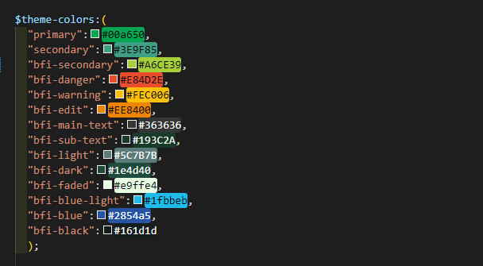

# bfi-theme-colors

## Install

```
npm install bfi-colors
```

```
Note that installing as a dev dependency --save-dev or -D will not work correctly.

```

### Usage

```
Create custom.scss file inside your assets folder

Add this lines to your custom.scss

Note that bfi-colors should be imported first before bootstrap.
```
```js live=true
@import "../node_modules/bfi-colors/scss/style";
@import "../node_modules/bootstrap/scss/bootstrap";
```
<!-- 
```css live=true

  "bfi-success":#00A651,
  "bfi-danger":#E84D2E,
  "bfi-warning":#FEC006,
  "bfi-edit":#EE8400,
  "bfi-text":#363636,
  "bfi-subtext":#193C2A,
``` -->
### Color preview



### Sample Usage


<!-- ### Compiles and minifies for production

```
npm run build
```

### Lints and fixes files

```
npm run lint
```

### Customize configuration -->

<!-- See [Configuration Reference](https://cli.vuejs.org/config/).
"# publish-test"
"# publish-test" -->
